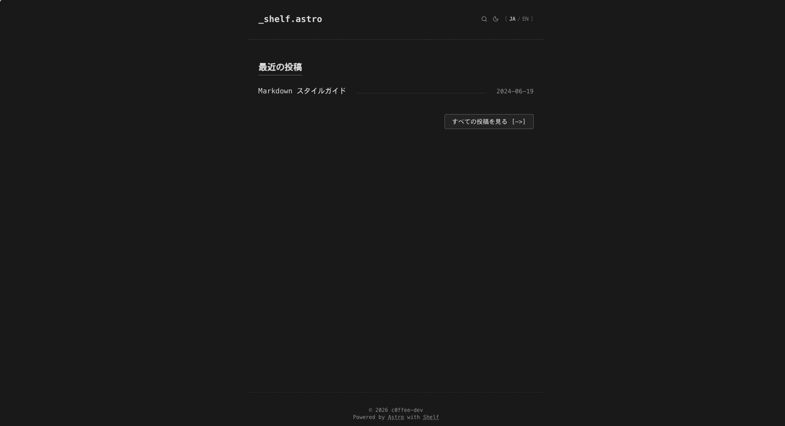

# Shelf Astro Theme

 

Simple blog theme for Astro.

## i18n

Shelf supports basic i18n support. (builtin support: Japanese (first-class), English, Korean)

You can change default language from `i18n.defaultLang` in `typewriter.config.ts`. You must restart server if changed `defaultLanguage`.
